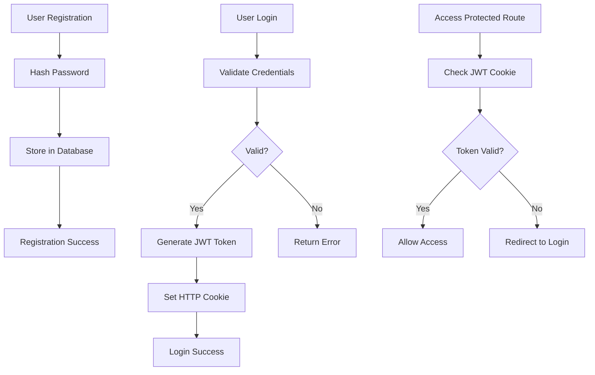
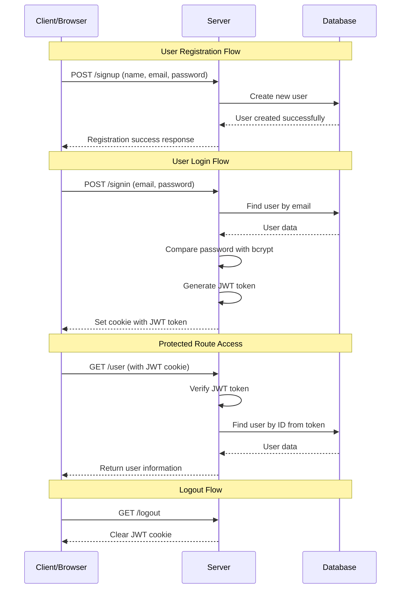

# JWT Authentication System

## Overview

This document outlines a JWT (JSON Web Token) based authentication system with user registration, login, and protected route access. The system provides secure user authentication using industry-standard practices.

## Key Components

### 1. User Registration (Signup)
- **Endpoint**: `POST /signup`
- **Purpose**: Creates new user accounts
- **Process**: 
  - Validates required fields (name, email, password, confirmPassword)
  - Validates email format using email-validator library
  - Uses Mongoose pre-save middleware to hash password with bcrypt (salt rounds: 10)
  - Handles duplicate email errors (MongoDB error code 11000)
  - Returns user data without password field

### 2. User Authentication (Login)
- **Endpoint**: `POST /signin`
- **Purpose**: Authenticates existing users
- **Process**:
  - Validates email and password presence
  - Finds user with password field included (`.select('+password')`)
  - Compares plain password with hashed password using bcrypt.compare()
  - Generates JWT token using user schema method
  - Sets HTTP-only cookie with 7-day expiration

### 3. Protected Routes
- **User Profile**: `GET /user` - Retrieves authenticated user data by ID from JWT
- **Logout**: `POST/GET /logout` - Clears authentication cookie

## Authentication Flow



## System Architecture



## Security Features

### Password Security
- **Bcrypt Hashing**: Passwords are hashed using bcrypt with salt rounds
- **Never Store Plain Text**: Original passwords are never stored in the database

### JWT Token Security
- **HTTP-Only Cookies**: Tokens stored in secure, HTTP-only cookies
- **Expiration**: Tokens have configurable expiration times (default: 60 * 60 * 24 * 7 seconds)
- **Secure Transmission**: Cookies marked as secure for HTTPS environments

### Input Validation
- Email format validation
- Password strength requirements
- Sanitization of user inputs

## API Endpoints

### Registration
```http
POST /signup
Content-Type: application/json

{
  "name": "John Doe",
  "email": "john@example.com", 
  "password": "securePassword123",
  "confirmPassword": "securePassword123"
}
```

**Response (Success)**:
```json
{
  "success": true,
  "message": "user are successfully created",
  "data": {
    "name": "John Doe",
    "email": "john@example.com",
    "_id": "user_id",
    "createdAt": "2023-01-01T00:00:00.000Z"
  }
}
```

**Response (Validation Error)**:
```json
{
  "success": false,
  "message": "all fields are required"
}
```

**Response (Invalid Email)**:
```json
{
  "success": false,
  "message": "plese enter a valid email"
}
```

**Response (Duplicate Email)**:
```json
{
  "success": false,
  "message": "account are already exist"
}
```

### Login
```http
POST /signin
Content-Type: application/json

{
  "email": "john@example.com",
  "password": "securePassword123"
}
```

**Response (Success)**:
```json
{
  "success": true,
  "message": "user successfuly signIn"
}
```

**Response (Error)**:
```json
{
  "status": false,
  "message": "invalid creadential"
}
```

**Response (Missing Fields)**:
```json
{
  "success": false,
  "message": "email and password are required"
}
```

### Get User Profile
```http
GET /user
Cookie: token=<jwt_token>
```

**Response**:
```json
{
  "success": true,
  "data": {
    "_id": "user_id",
    "name": "John Doe",
    "email": "john@example.com",
    "createdAt": "2023-01-01T00:00:00.000Z"
  }
}
```

**Response (User Not Found)**:
```json
{
  "success": false,
  "message": "user not found"
}
```

### Logout
```http
GET /logout
```

**Response**:
```json
{
  "success": true,
  "message": "user successfully logout"
}
```
## Implementation Notes

## Implementation Details

### Dependencies Used
```javascript
import UserModel from "../models/userSchema.js";
import * as EmailValidator from 'email-validator';
import bcrypt from 'bcryptjs';
import jwt from 'jsonwebtoken';
```

### Password Security Implementation
```javascript
// Pre-save middleware in userSchema
userSchema.pre("save", async function(next){
    if(!(this.isModified("password"))) return next()
    try {
        const hashedPassword = await bcrypt.hash(this.password, 10)
        this.password = hashedPassword
    } catch (error) {
        next(error)
    }
    next()
})
```

### JWT Token Generation
```javascript
// User schema method for JWT token
userSchema.methods = {
    jwtToken(){
        return jwt.sign(
            {
                id: this._id,
                name: this.name,
                email: this.email,
            },
            process.env.SECREATE_KEY,
            {
                expiresIn: "24h"
            }
        )
    }
}
```

### Cookie Configuration
```javascript
// Login - Set cookie with 7-day expiration
res.cookie("token", token, { 
    httpOnly: true, 
    maxAge: 60 * 60 * 24 * 7 // 7 days in seconds
})

// Logout - Clear cookie by setting null and immediate expiration
res.cookie("token", null, {
    httpOnly: true, 
    expires: new Date()
})
```

### Input Validation Features
- **Required Fields**: Validates all required fields are present
- **Email Validation**: Uses `email-validator` library for email format validation
- **Password Confirmation**: Includes confirmPassword field in signup
- **Duplicate Email Handling**: Catches MongoDB duplicate key error (code 11000)

### Frontend Considerations
- Automatic cookie handling by browser
- Redirect logic for unauthorized access
- Form validation and error display
- Secure HTTPS communication

### Environment Variables
```env
SECREATE_KEY=your_super_secure_jwt_secret
# Note: Your code uses SECREATE_KEY (with typo)
# Consider using JWT_SECRET for standard naming
```
