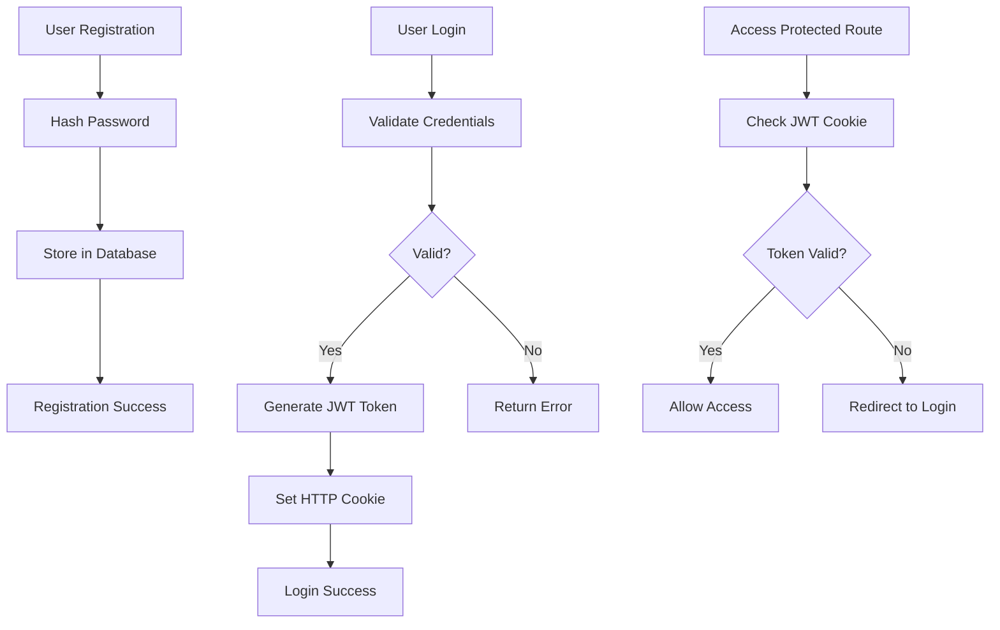
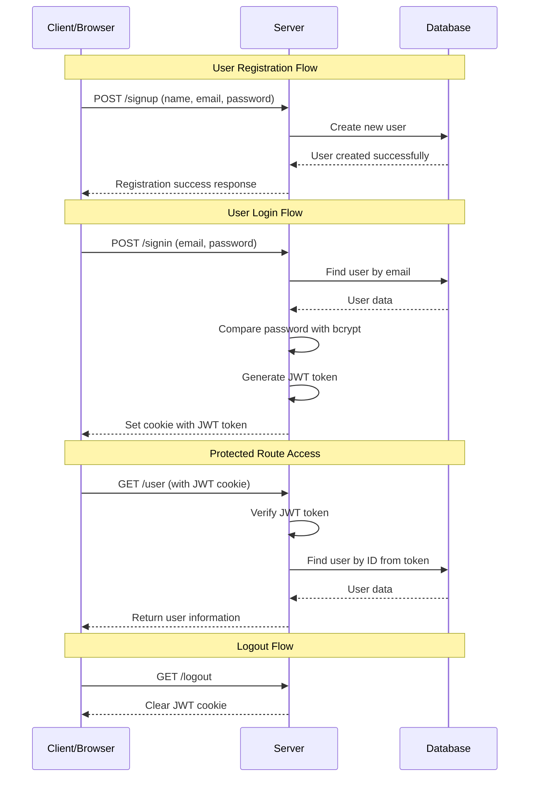
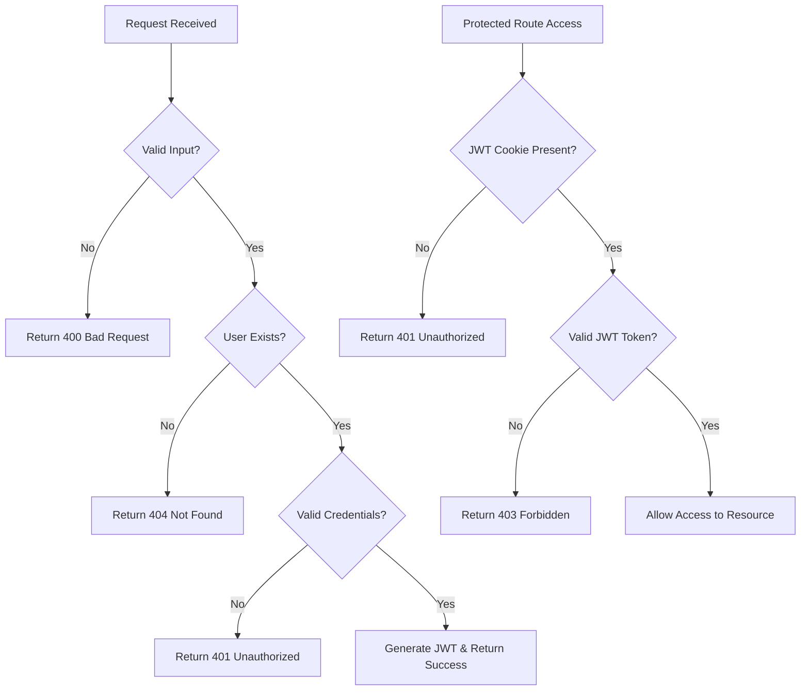

# JWT Authentication System

## Overview

This document outlines a JWT (JSON Web Token) based authentication system with user registration, login, and protected route access. The system provides secure user authentication using industry-standard practices.

## Key Components

### 1. User Registration (Signup)
- **Endpoint**: `POST /signup`
- **Purpose**: Creates new user accounts
- **Process**: 
  - Validates user input (name, email, password)
  - Hashes password for secure storage
  - Stores user data in database
  - Returns success confirmation

### 2. User Authentication (Login)
- **Endpoint**: `POST /signin`
- **Purpose**: Authenticates existing users
- **Process**:
  - Validates credentials against database
  - Compares hashed passwords using bcrypt
  - Generates JWT token upon successful authentication
  - Sets secure HTTP-only cookie with token

### 3. Protected Routes
- **User Profile**: `GET /user` - Retrieves authenticated user data
- **Logout**: `GET /logout` - Invalidates user session

## Authentication Flow



## System Architecture



## Security Features

### Password Security
- **Bcrypt Hashing**: Passwords are hashed using bcrypt with salt rounds
- **Never Store Plain Text**: Original passwords are never stored in the database

### JWT Token Security
- **HTTP-Only Cookies**: Tokens stored in secure, HTTP-only cookies
- **Expiration**: Tokens have configurable expiration times (default: 60 * 60 * 24 * 7 seconds)
- **Secure Transmission**: Cookies marked as secure for HTTPS environments

### Input Validation
- Email format validation
- Password strength requirements
- Sanitization of user inputs

## API Endpoints

### Registration
```http
POST /signup
Content-Type: application/json

{
  "name": "John Doe",
  "email": "john@example.com", 
  "password": "securePassword123"
}
```

**Response (Success)**:
```json
{
  "success": true,
  "message": "User successfully created"
}
```

### Login
```http
POST /signin
Content-Type: application/json

{
  "email": "john@example.com",
  "password": "securePassword123"
}
```

**Response (Success)**:
```json
{
  "success": true,
  "message": "User successfully signed in"
}
```

**Response (Error)**:
```json
{
  "status": false,
  "message": "Invalid credentials"
}
```

### Get User Profile
```http
GET /user
Cookie: token=<jwt_token>
```

**Response**:
```json
{
  "success": true,
  "data": {
    "id": "user_id",
    "name": "John Doe",
    "email": "john@example.com"
  }
}
```

### Logout
```http
GET /logout
```

**Response**:
```json
{
  "success": true,
  "message": "User successfully logged out"
}
```

## Error Handling



## Implementation Notes

### Backend Requirements
- **Node.js** with Express.js framework
- **JWT library** for token generation and verification
- **Bcrypt** for password hashing
- **Database** (MongoDB, PostgreSQL, etc.) for user storage
- **Cookie-parser** middleware for handling cookies

### Frontend Considerations
- Automatic cookie handling by browser
- Redirect logic for unauthorized access
- Form validation and error display
- Secure HTTPS communication

### Environment Variables
```env
JWT_SECRET=your_super_secure_jwt_secret
JWT_EXPIRES_IN=7d
DB_CONNECTION_STRING=your_database_url
BCRYPT_SALT_ROUNDS=12
```

## Best Practices Implemented

1. **Password Security**: Never store plain text passwords
2. **Token Storage**: Use HTTP-only cookies instead of localStorage
3. **Input Validation**: Validate all user inputs on both client and server
4. **Error Handling**: Consistent error responses without information leakage
5. **Secure Communication**: HTTPS for all authentication endpoints
6. **Token Expiration**: Implement reasonable token expiration times
7. **Logout Mechanism**: Proper session invalidation

## Future Enhancements

- **Refresh Tokens**: Implement token refresh mechanism
- **Rate Limiting**: Add login attempt rate limiting
- **Email Verification**: Email confirmation for new registrations
- **Password Reset**: Secure password reset functionality
- **Multi-Factor Authentication**: Additional security layer
- **Session Management**: Advanced session handling and monitoring
